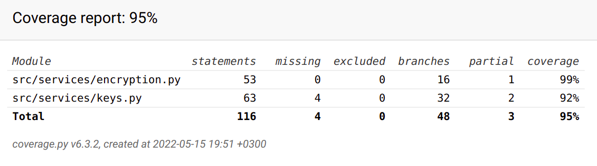

# Testing

## Unit testing

The software has automated unit tests for the functions that are used in key creation, encryption and decryption.
Test coverage is 96 %.



### Running the tests

1. Install the necessary dependencies with the command before using the app / running the tests for the first time

```bash
poetry install
```

2. Run tests

```bash
poetry run invoke test
```

3. Create coverage report

```bash
poetry run invoke coverage-report
```

## Performance testing

Key creation performance has been tested with 100 key pairs of 1024 and 2048 bits.

### 1024-bit keys:

| Creation time | Seconds |
|:--------------|:-------:|
| Average       | 0.302   |
| Minimum       | 0.142   |
| Maximum       | 0.588   |

### 2048-bit keys:

| Creation time | Seconds |
|:--------------|:-------:|
| Average       | 2.861   |
| Minimum       | 0.956   |
| Maximum       | 8.674   |

### Running the performance test 

You can repeat the performance test in the root directory with this command:

```bash
poetry run invoke performance-test
```

## Manual testing

In addition to automated tests, encryption and decryption have been tested manually with various input messages, and all bugs that were found were fixed.
